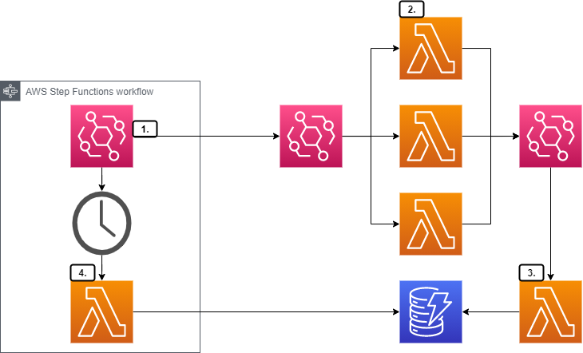

# Application Integration Patterns

Implementations of application integration patterns using AWS technologies. Deployed with Terraform.

## Patterns

### [Scatter Gather](./src/scatter-gather/)

An implementation of the scatter gather pattern using an aggregator to combine results.



1. Step Functions workflow is invoked with details of the loan that quotes are required for. This workflow publishes a request-loan-offers event to Event Bridge. The event payload includes a correlation id, as well as details of the loan.
``` json
{
  "CustomerId": "James Eastham",
  "CorrelationId": "2354235231",
  "LoanAmount": 567.98
}
```
2. A seperate Lambda function per bank/vendor is deployed that implements specific loan generation logic for that bank. The Lambdas are configured with Event Bridge as an event source, listening for the request-loan-offers event

3. As each vendor processor completes it in turn publishes an event to event bridge containing details of the quoted loan. This event also includes the correlation id from the original request. This vendor specific data is stored in a DynamoDB table with the correlation id as the partition key

4. After a pre-defined wait period, the Step Function workflow continues. A Lambda is invoked to aggregate the results from the DynamoDB table and return the final combined list of loan offers.

## Pattern Roadmap

- [Request-Reply](https://www.enterpriseintegrationpatterns.com/RequestReply.html)
  - Return address
  - CorrelationId
- [Smart Proxy](https://www.enterpriseintegrationpatterns.com/SmartProxy.html)
- [Routing Slip](https://www.enterpriseintegrationpatterns.com/patterns/messaging/RoutingTable.html)
- [Resequencer](https://www.enterpriseintegrationpatterns.com/Resequencer.html)
- [Wire Tap](https://www.enterpriseintegrationpatterns.com/patterns/messaging/WireTap.html)
- [Message History](https://www.enterpriseintegrationpatterns.com/patterns/messaging/MessageHistory.html)
- [MessageStore](https://www.enterpriseintegrationpatterns.com/patterns/messaging/MessageStore.html)