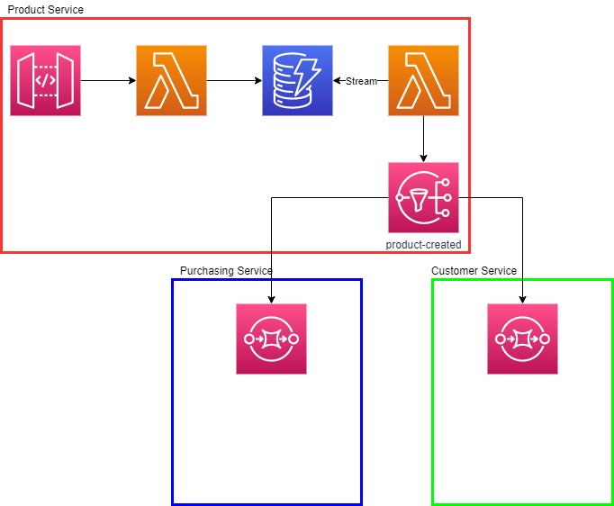

# Sample Application

A sample application demonstrating application integration patterns in a real world setting. The front-end application receives requests to creates new products. On creation events are published to notify other systems, this demonstrates the publish/subscribe pattern.

Product creation requests are created through an API Gateway endpoint and procesed by a Lambda function. Data is persisted into DynamoDB. An event handling Lambda is connected to the DynamoDB stream and for all insert events a 'product-created' event is published to an SNS Topic.

The customer service and purchasing service are subscribed to product-created events and store the event data in a queue for further processing.

